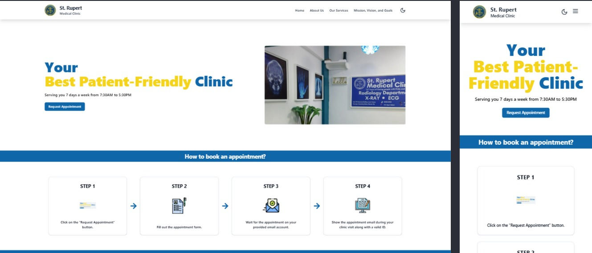

# St. Rupert Clinic Medical Appointment System



This is an **Online Appointment and Clinic Management System** for **St. Rupert Medical Clinic**. The platform allows patients to book appointments, view clinic information, and for admins to manage schedules, appointments, and archives through a secure dashboard.

## Features

- Patient appointment booking with email verification and payment integration
- Real-time appointment slot availability and time slot management
- Admin dashboard for managing appointments, archives, and analytics
- Role-based access (admin/non-admin)
- Email notifications for appointment confirmation and verification
- Responsive design for desktop and mobile
- Privacy policy and terms of service pages
- FAQ, services, and clinic information pages

## Tech Stack

- **Frontend**:
  - Vue 3 (Composition API, `<script setup>`)
  - TypeScript
  - [Shadcn/UI](https://ui.shadcn.com) component library (Vue port)
  - Tailwind CSS for utility-first styling
  - Vue Router for client-side navigation
  - Axios for HTTP requests
  - Pinia for Role Based Access
  - Lucide Icons for modern SVG icons
- **Backend**:
  - Node.js with Express.js (API endpoints)
  - Email sending for verification and notifications
  - RESTful API architecture
  - Database (Supabase)

## API Testing

- We provide a **Postman collection** for testing all backend API endpoints.  
  Access it here:  
  [St. Rupert Clinic API Postman Collection](https://st-rupert-ewan.postman.co/workspace/St-Rupert-Ewan-Workspace~e8412ed8-1894-4ce3-82b2-c842513bf6b6/collection/39877725-95c1520b-531e-44ad-9b01-7e4e8cde0b51?action=share&creator=39877725)

- Please refer to this collection for comprehensive backend testing and endpoint documentation.

## Deployment

- The frontend is **deployed on [Vercel](https://vercel.com/)** for production use.

## Setup

### Prerequisites

- Node.js (v16 or higher)
- npm
- Backend server running (see backend setup guide)

### Installation

1. Clone the repository:
   ```bash
   git clone <repository-url>
   cd st-rupert-clinic-appointment-system
   ```

2. Install dependencies:
   ```bash
   npm install
   ```

3. Create a `.env` file in the root directory and configure the following environment variable:
   ```bash
   VITE_BACKEND_URL=http://your-backend-server-address
   ```

4. Start the development server:
   ```bash
   npm run dev
   ```

5. Open your browser and navigate to `http://localhost:5173`.

### Build for Production

To build the project for production, run:
```bash
npm run build
```

The production-ready files will be available in the `dist/` directory.

### Deployment

1. Deploy the `dist/` directory to a static hosting service (e.g., Netlify, Vercel, or your own server).
2. Ensure the backend API is accessible from the deployed frontend.

## Backend Repository

The backend for this project is available at:  
[https://github.com/batdimoiprint/st-rupert-clinic-appointment-backend](https://github.com/kenny2125/st-rupert-clinic-appointment-backend)

## License

This project is licensed under the MIT License. See the `LICENSE` file for details.
